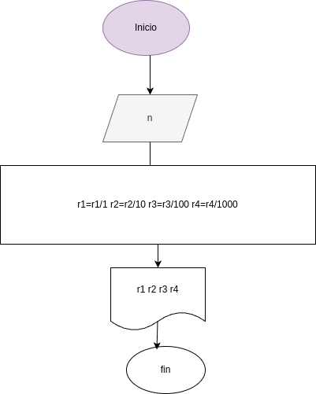

# Programa 3: Numero-inverso
programa en paython para invertir numeros de 4 dijitos
# Análisis 

### Variables de entrada

- n = Número entero de cuatro cifras

### Procesamiento

- ni = Número entero invertido 
- r1 = guarda la primera cifra (unidad)
- r2 = guarda la segunda cifra (decena)
- r3 = guarda la tercera cifra (centena)
- r4 = guarda la cuarta cifra (unidad de mil)

r1 = r1/1 
r2 = r2/10
r3 = r3/100
r4 = r4/1000

## Diseño

### Construcción

- Codigo implementado en el archivo numero_inverso.py
